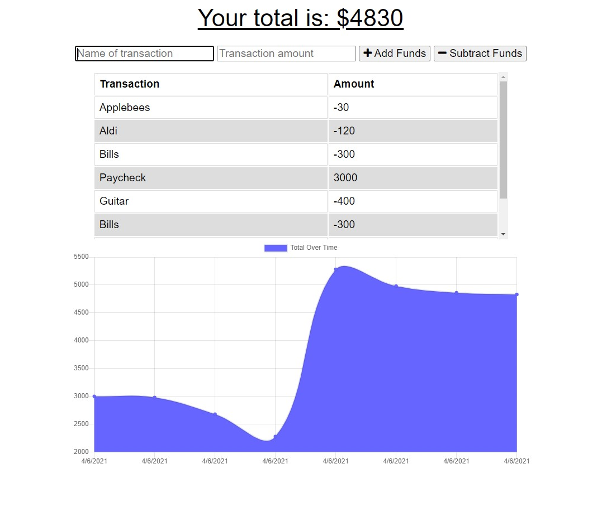

# Budget-Tracker

    
## Description
    
This application allows a user to keep track of their budget. Users can enter transaction names, transaction amounts, and either add or subtract funds. The total is logged at the top of the screen each time either the "Add Funds" or "Subtract Funds" buttons are clicked. Underneath the list of all transactions, there is also a chart that follows along with all of the transactions that are entered.

Another feature of this application is that it works offline. A user is able to enter deposits and expenses offline and see the resulting total and graph. The values entered offline are stored locally in IndexedDB. Once the application is brought back online, the offline entries are posted to the server and saved in the database.

This application uses MongoDB to store the data entered by the user. Express, mongoose, morgan, babel, compression, lite-server, and webpack are also dependencies of this app.

Heroku is used for deployment (see [Usage](#usage) tab for link).
       

## Table of Contents
    
* [Installation](#installation)
    
* [Usage](#usage)
    
* [Contributions](#contributions)
    
* [Tests](#tests)
    
* [License](#license)
    
* [Contact](#contact)
    
    
## Installation
    
If running application locally, this requires "npm i" in the command terminal to install dependencies.
    
    
## Usage
    
The deployed application can be found here: https://tracking-finances.herokuapp.com/

Image of application:

    
## Contributions
    
Contributions are welcome in the form of suggestions.
    
    
## Tests
    
There are no test procedures for this application.
    
    
## License
None
    
    
## Contact
Questions? Contact me at:
 
GitHub username: diane-furlong  
Email address: dfurlongm@gmail.com
